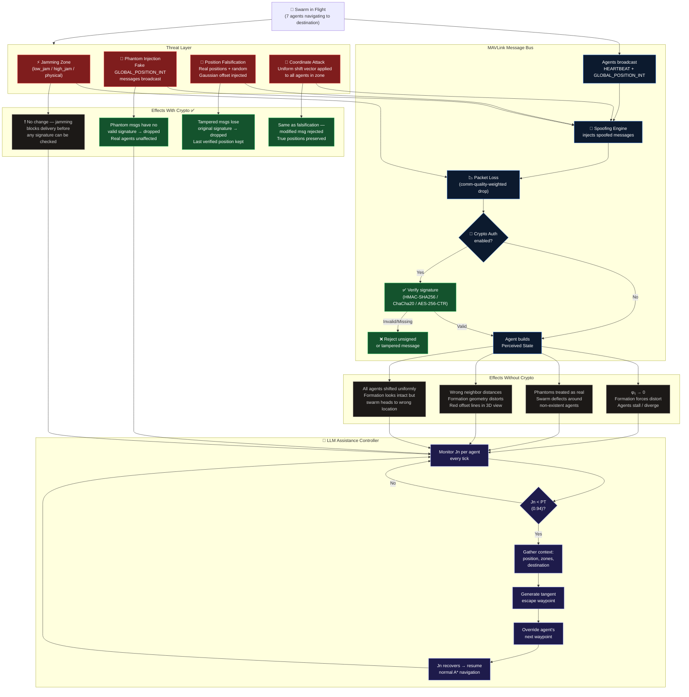

# 3D Multi-Vehicle Simulation

A comprehensive 3D multi-vehicle swarm simulation with MAVLink communication, spoofing/jamming attack modeling, cryptographic authentication, LLM-powered chat control, and human-in-the-loop (HITL) feedback.

## Features

### Core Simulation

- **3D Visualization**: Real-time Three.js visualization with labeled axes, interactive camera controls
- **Multi-Agent System**: Configurable number of vehicles with individual state tracking
- **Jamming Zones**: Spherical jamming zones that degrade vehicle communication quality
- **Spoofing Attacks**: Phantom injection, position falsification, and coordinate shift attacks
- **MAVLink Protocol**: Simulated MAVLink message bus with packet loss, spoofing injection, and crypto verification pipeline

### Algorithm Framework

- **Formation Control**: Communication-aware distributed control, V-formation, line, circle, wedge, column, diamond patterns
- **Path Planning**: A\*, Theta\*, Dijkstra, greedy, BFS, bidirectional A\*, MSP, and direct with behavior-based avoidance
- **Jamming Response**: Avoidance, penetration, scatter, and fallback strategies

### Security

- **Cryptographic Authentication**: HMAC-SHA256, ChaCha20-Poly1305, AES-256-CTR for MAVLink message verification
- **Spoofing Detection**: Crypto-authenticated messages filter out spoofed/phantom agents

### LLM Integration

- **Natural Language Control**: Control vehicles via chat commands with MCP-style tool calling
- **LLM Assistance Controller**: Automatically assists agents when communication quality drops below threshold
- **Ollama Backend**: Configurable LLM model (default: llama3.2:3b-instruct-q4_K_M)
- **RAG Support**: Unified semantic search across telemetry and logs via Qdrant
- **Human-in-the-Loop**: Chat panel for real-time operator intervention and feedback

### Data Storage (Qdrant)

- **Telemetry Collection**: Agent positions, states, communication quality
- **Logs Collection**: Conversation history, commands, notifications
- **Simplified Architecture**: Single vector database for all storage and RAG retrieval

## Quick Start

### Prerequisites

- Python 3.11+
- Docker & Docker Compose
- Ollama (for LLM features)
- [uv](https://github.com/astral-sh/uv) package manager (recommended)

### Setup

```bash
# Navigate to sim directory
cd sim

# Create and activate virtual environment with uv
uv venv
source .venv/bin/activate  # Linux/Mac
# or: .venv\Scripts\activate  # Windows

# Install dependencies
uv pip install -e ".[dev]"

# Copy environment template
cp .env.example .env
# Edit .env as needed

# Start Qdrant vector database
docker compose up -d

# Start Ollama (if not running)
ollama serve  # In another terminal

# Start the simulation
python -m src.main
```

### Access Points

- **Dashboard**: http://localhost:5000
- **Simulation API**: http://localhost:5001
- **Qdrant UI**: http://localhost:6333/dashboard

## Project Structure

```
sim/
├── src/
│   ├── config.py              # Centralized configuration
│   ├── main.py                # Main entry point
│   ├── algo/                  # Algorithm framework
│   │   ├── base.py            # Base classes (JammingZone, VehicleCommand)
│   │   ├── controller.py      # Unified multi-vehicle controller
│   │   ├── crypto_auth.py     # Cryptographic authentication (HMAC/ChaCha20/AES)
│   │   ├── formation.py       # Formation patterns
│   │   ├── jamming_response.py # Jamming response strategies
│   │   ├── llm_controller.py  # LLM assistance controller
│   │   ├── mavlink.py         # MAVLink protocol bus simulation
│   │   ├── path_planning.py   # Path planning algorithms
│   │   ├── path_planning_3d.py # 3D pathfinding with pathfinding3d library
│   │   ├── spoofing.py        # Spoofing attack engine
│   │   └── utils_3d.py        # 3D utility functions
│   ├── simulation/
│   │   ├── api.py             # FastAPI simulation endpoints
│   │   └── agents.py          # Agent state management
│   ├── chat/
│   │   ├── app.py             # FastAPI chat/dashboard endpoints
│   │   ├── llm.py             # LLM agent with tool calling loop
│   │   └── tools.py           # MCP tools (move, status, spoofing, crypto)
│   └── rag/
│       └── qdrant.py          # Qdrant telemetry & log storage
├── static/
│   ├── css/style.css
│   ├── index.html
│   └── js/
│       ├── app.js             # Main application logic
│       ├── scene3d.js         # Three.js 3D visualization
│       └── chat.js            # Chat interface
├── docker-compose.yml         # Qdrant vector database
├── pyproject.toml             # Python dependencies
└── .env.example               # Environment template
```

## Configuration

All configuration is done via environment variables in `.env` file. Copy `.env.example` to `.env` and modify as needed.

### Key Configuration Options

#### Agent Configuration

```bash
NUM_AGENTS=5                    # Number of vehicles
AGENT_POSITION_MODE=random      # "random" or "manual"
# For manual positions (JSON array):
# AGENT_POSITIONS_MANUAL=[[-5, 14, 0], [-5, -19, 5], [0, 0, -5]]
```

#### Obstacle/Jamming Zone Configuration

```bash
NUM_OBSTACLES=0                 # Number of random obstacles
OBSTACLE_POSITION_MODE=manual   # "random" or "manual"
# For manual obstacles (JSON array of [x, y, z, radius] or [x, y, z, radius, type]):
# OBSTACLES_MANUAL=[[35, 75, 15, 10], [20, 50, 10, 15, "high_jam"]]
```

#### Spoofing Zone Configuration

```bash
# Default spoofing type: "phantom", "position_falsification", "coordinate"
DEFAULT_SPOOF_TYPE=phantom

# Phantom attack: ghost agents per zone
PHANTOM_COUNT=2

# Position falsification: random offset magnitude
POSITION_FALSIFICATION_MAGNITUDE=8.0

# Coordinate attack: systematic shift vector [x, y, z]
COORDINATE_ATTACK_VECTOR=[10.0, 10.0, 0.0]

# Manual spoofing zones (JSON array of [x, y, z, radius, spoof_type]):
SPOOFING_ZONES_MANUAL=[[20, 60, 10, 30, "phantom"]]
```

#### MAVLink & Cryptographic Authentication

```bash
MAVLINK_ENABLED=true            # Enable MAVLink protocol simulation
MAVLINK_PACKET_LOSS_BASE=0.02   # Base packet loss rate
CRYPTO_AUTH_ENABLED=false       # Enable crypto auth (filters spoofed messages)
```

#### LLM Assistance

```bash
LLM_ASSISTANCE_ENABLED=true     # Auto-assist jammed agents via LLM
```

#### Algorithm Defaults

```bash
DEFAULT_FORMATION=communication_aware  # or v_formation, line, etc.
DEFAULT_PATH_ALGORITHM=astar           # or direct, dijkstra, theta_star, etc.
DEFAULT_OBSTACLE_TYPE=low_jam          # or physical, high_jam
```

#### Communication-Aware Formation Parameters

```bash
ALPHA=1e-5          # Antenna characteristic
DELTA=2.0           # Required data rate
R0=5.0              # Reference distance
V_PATH_LOSS=3.0     # Path loss exponent
PT=0.94             # Reception probability threshold
```

#### Behavior-Based Control Parameters

```bash
ATTRACTION_MAGNITUDE=0.7   # Destination attraction strength
AVOIDANCE_MAGNITUDE=3.5    # Obstacle avoidance strength
BUFFER_ZONE=8.0            # Obstacle buffer zone size
WALL_FOLLOW_ZONE=4.0       # Wall following zone size
```

### Full Environment Variables (`.env`)

```bash
# LLM Configuration
OLLAMA_HOST=http://localhost:11444
LLM_MODEL=llama3.2:3b-instruct-q4_K_M

# Database
DB_HOST=localhost
DB_PORT=5435

# Qdrant
QDRANT_HOST=localhost
QDRANT_PORT=6333

# Simulation
NUM_AGENTS=5
X_MIN=-10
X_MAX=10
Y_MIN=-10
Y_MAX=10
Z_MIN=0
Z_MAX=20
MISSION_END_X=10
MISSION_END_Y=10
MISSION_END_Z=0

# API Ports
SIM_API_PORT=5001
CHAT_API_PORT=5000
```

## API Endpoints

### Simulation API (port 5001)

| Endpoint               | Method | Description                      |
| ---------------------- | ------ | -------------------------------- |
| `/agents`              | GET    | Get all agent states             |
| `/agents/{id}`         | GET    | Get specific agent               |
| `/move_agent`          | POST   | LLM-commanded move               |
| `/jamming_zones`       | GET    | List jamming zones               |
| `/jamming_zones`       | POST   | Create jamming zone              |
| `/jamming_zones/{id}`  | DELETE | Delete jamming zone              |
| `/simulation/start`    | POST   | Start autonomous simulation      |
| `/simulation/stop`     | POST   | Stop simulation                  |
| `/simulation/reset`    | POST   | Reset to initial state           |
| `/simulation/state`    | GET    | Get formation metrics            |
| `/spoofing_zones`      | GET    | List spoofing zones              |
| `/spoofing_zones`      | POST   | Create spoofing zone             |
| `/spoofing_zones/{id}` | DELETE | Delete spoofing zone             |
| `/protocol_stats`      | GET    | MAVLink protocol statistics      |
| `/llm_context`         | GET    | LLM context (jamming + spoofing) |
| `/llm_activity`        | GET    | Recent LLM assistance activity   |
| `/visualization`       | GET    | Comm links & waypoints           |

### Chat API (port 5000)

| Endpoint          | Method          | Description         |
| ----------------- | --------------- | ------------------- |
| `/`               | GET             | Dashboard HTML      |
| `/health`         | GET             | System health check |
| `/chat`           | POST            | Send chat message   |
| `/agents`         | GET             | Proxy to sim API    |
| `/jamming_zones`  | GET/POST/DELETE | Proxy to sim API    |
| `/spoofing_zones` | GET/POST/DELETE | Proxy to sim API    |
| `/llm_context`    | GET             | Proxy to sim API    |
| `/llm_activity`   | GET             | Proxy to sim API    |

## Usage

### Dashboard Controls

1. **3D Scene**
   - Left drag: Rotate view
   - Right drag: Pan
   - Scroll: Zoom
   - Click vehicle: Select for details

2. **Agent Panel**
   - Shows all agents with real-time status
   - Position, speed, heading, communication quality
   - Formation role and distance to goal

3. **Jamming Zones Panel**
   - List all active jamming zones
   - Add new zones with center coordinates and radius
   - Delete zones with the x button

4. **Spoofing Zones Panel**
   - List active spoofing zones with attack type indicators
   - Add phantom, position falsification, or coordinate attack zones
   - Phantom vehicles rendered as purple translucent ghosts in 3D scene
   - Delete zones individually or clear all

5. **LLM Context Panel**
   - Agents being assisted (communication quality below PT threshold)
   - Active LLM guidance with countdown timers
   - Jamming zones display (red badges)
   - Spoofing zones display (orange badges with attack type)
   - Last LLM prompt preview with reasoning

6. **Algorithm Control**
   - Select formation type
   - Choose path planning algorithm
   - Set default obstacle type (physical, low_jam, high_jam)
   - Toggle MAVLink protocol and crypto authentication
   - Start/Stop/Reset simulation

7. **Chat Control**
   - Natural language queries: "Where is agent1?"
   - Direct commands: "Move agent1 to 5, 5"
   - Spoofing commands: "Add a phantom spoofing zone at 20, 60"
   - Crypto commands: "Enable crypto auth"
   - Tool call results displayed inline

### Chat Commands

```
# Move commands
move agent1 to 5, 5
move agent2 to (3, 7, 2)

# Status queries
where is agent1?
what is the status of all agents?
is any agent jammed?

# Spoofing management
add a phantom spoofing zone at 20, 60, 10 with radius 30
remove all spoofing zones

# Security
enable crypto auth
disable crypto auth

# Simulation control
get simulation status
```

## MAVLink Communication Pipeline

Each simulation tick processes messages through this pipeline:

1. **Broadcast**: All agents broadcast MAVLink HEARTBEAT + GLOBAL_POSITION_INT
2. **Spoofing Injection**: Active spoofing zones inject phantom/falsified messages
3. **Packet Loss**: Communication-quality-based probabilistic packet drop
4. **Crypto Verification**: If enabled, HMAC-SHA256/ChaCha20/AES filters unauthenticated messages
5. **Build Perceived State**: Each agent's view of neighbors based on received messages

## Attack Scenarios & Defense

This section describes exactly what happens to the swarm under each threat, how encryption changes the outcome, and how the LLM assists recovery.



### Jamming Zone

A jamming zone degrades the wireless signal strength for any agent inside it. The effect is continuous and probabilistic — agents are not immediately cut off, but reliability drops.

**What happens (no crypto):**

- The communication quality metric $\varphi_{ij}$ drops toward zero for agent pairs where one agent is inside the zone.
- The formation control algorithm detects that neighbor links are degrading and tries to compensate by pulling agents closer together (increasing gradient forces).
- If quality falls below the threshold $P_T$ (default 0.94), the jammed agent is flagged and the LLM assistance controller activates.
- Without reliable comms, agents may diverge from their planned paths, collide with each other, or stall near the zone boundary.
- MAVLink heartbeat messages are dropped probabilistically based on jamming intensity; agents lose situational awareness of jammed neighbors.

**What happens (with crypto):**

- Crypto authentication does **not** counter jamming. Jamming is a physical-layer attack that prevents message delivery entirely — there is no message to sign or verify.
- The same communication degradation occurs. Crypto only helps against spoofing.

**Jam type effects:**

| Type       | Packet loss | Jamming intensity | Agents can pass through?        |
| ---------- | ----------- | ----------------- | ------------------------------- |
| `physical` | 100% inside | Total blockage    | No — treated as hard obstacle   |
| `low_jam`  | ~30–50%     | Mild              | Yes — formation adjusts         |
| `high_jam` | ~80–95%     | Severe            | Risky — forces scatter/fallback |

---

### Phantom Spoofing Attack

Phantom injection fabricates non-existent agents. Fake `GLOBAL_POSITION_INT` MAVLink messages are broadcast by the spoofing engine, claiming there are additional vehicles inside the zone.

**What happens (no crypto):**

- Real agents receive these messages and incorporate the phantom positions into their perceived neighbor state.
- The formation controller reacts to phantoms as if they were real: it tries to maintain spacing with them, causing real agents to adjust their trajectories toward or around the false positions.
- Depending on phantom placement, the swarm can be partially deflected away from the destination, split apart, or driven into a jamming zone or obstacle.
- Phantom agents appear in the 3D visualization as translucent purple ghost vehicles orbiting the zone center.

**What happens (with crypto):**

- Every legitimate agent's MAVLink messages are signed with HMAC-SHA256, ChaCha20-Poly1305, or AES-256-CTR.
- Phantom messages injected by the spoofing engine have no valid signature (`signature=None`).
- The crypto auth layer **rejects** these messages before they reach any agent's perceived state.
- Real agents never "see" the phantoms; formation and navigation are unaffected.
- Crypto rejection count increments in the Protocol Stats panel.

---

### Position Falsification Attack

Position falsification corrupts the reported positions of real agents already inside the zone by adding a random Gaussian offset to their `GLOBAL_POSITION_INT` payloads.

**What happens (no crypto):**

- Affected agents appear to be somewhere they are not. Their neighbors update their perceived positions based on the falsified coordinates.
- Formation control computes gradients using wrong distances, causing incorrect spacing corrections. The swarm distorts spatially.
- Red dashed lines in the 3D scene show the displacement between an agent's true position and its spoofed broadcast position.
- Agents may navigate into obstacles or jamming zones because their neighbors are giving them false distance information.

**What happens (with crypto):**

- The spoofing engine strips the original signature when it modifies a message (`signature=None`).
- The crypto auth layer detects the missing/invalid signature and drops the modified message.
- Neighbors fall back to the last verified position or treat the agent as temporarily unreachable (link degraded), rather than using the falsified coordinates.
- The swarm may temporarily lose a link but maintains correct spatial awareness.

---

### Coordinate Attack

A coordinate attack applies a **uniform systematic shift** to all affected agents' reported positions. Unlike position falsification (random per-agent offsets), all agents in the zone are shifted by the same vector, so the formation appears internally consistent — just translated in space.

**What happens (no crypto):**

- Every agent in the zone broadcasts a position offset by the attack vector (e.g. +10 m in X and Y).
- Neighbors outside the zone see those agents as being in a different location. The perceived swarm "splits" — some agents appear far from where they actually are.
- Navigation systems using perceived neighbor positions may guide agents toward incorrect waypoints, effectively redirecting the swarm toward a false destination.
- This is the stealthiest attack: the formation looks intact from a consistency check but the absolute reference frame is wrong.

**What happens (with crypto):**

- Same mechanism as position falsification: modified messages lose their signatures.
- Crypto auth rejects the message; the unmodified original position (from a previous verified message) is retained.

---

### LLM Assistance During Attacks

The LLM Assistance Controller monitors every agent's communication quality every simulation tick. When an agent's $J_n$ (average communication performance) falls below the threshold $P_T$:

1. **Detection**: The controller flags the agent as jammed/degraded and adds it to the "Agents Being Assisted" list in the LLM Context panel.
2. **Context gathering**: The LLM receives the agent's current position, the jamming/spoofing zones present, and the mission destination.
3. **Guidance generation**: The LLM produces a waypoint instruction — typically a tangent escape route around the zone boundary that keeps the agent moving toward the destination.
4. **Execution**: The guidance vector is injected as the agent's next waypoint override, bypassing the normal A\* path for that tick.
5. **Release**: Once the agent clears the zone and communication quality recovers above $P_T$, normal autonomous control resumes.

**Without crypto, the LLM faces adversarial conditions**: if phantom agents are present, the LLM's situational context (retrieved from the simulation state API) may include phantom positions. The LLM might advise routing around a "vehicle" that doesn't exist — suboptimal but not catastrophic.

**With crypto enabled**: phantom and falsified data are filtered at the MAVLink layer before they reach agent state. The LLM therefore operates on clean, verified telemetry and produces more accurate routing guidance.

The operator can interact with the LLM via the Chat panel to override guidance manually at any time:

```bash
# Force an agent away from a zone
move agent3 to 50, 100, 20

# Add a spoofing zone to test defenses
add a phantom spoofing zone at 30, 80 with radius 25

# Enable crypto to neutralize the attack
enable crypto auth

# Check what the LLM is doing
get simulation status
```

## Algorithm Framework

### Formation Types

- `communication_aware` **(default)**: **Distributed** control algorithm with NO leader/follower hierarchy. Uses communication quality metrics (aij, gij, rho_ij) to maintain optimal inter-agent distances. All agents are equal.
- `v_formation`: Classic V-shape (like flying geese) - has leader/wingman/follower roles
- `line`: Side-by-side horizontal line
- `circle`: Circular arrangement
- `wedge`: Arrow/wedge shape
- `column`: Single file
- `diamond`: Diamond pattern

### Path Planning

- `direct` **(default)**: Direct destination with behavior-based obstacle avoidance - includes wall-following, exponential repulsion
- `astar`: A\* grid-based pathfinding (pathfinding3d) - optimal and efficient
- `theta_star`: Theta\* with line-of-sight optimization - smoother paths
- `dijkstra`: Dijkstra's shortest path - guaranteed optimal
- `bfs`: Breadth-First Search - unweighted shortest path
- `greedy`: Greedy Best-First Search - fast but not optimal
- `bi_astar`: Bidirectional A\* - searches from both ends
- `msp`: Minimum Spanning Tree - explores all reachable space

### Jamming Response

- `avoidance`: Route around jamming zones
- `penetration`: Speed through zones quickly
- `scatter`: Spread out formation
- `fallback`: Return to last safe position

### Communication-Aware Formation Control (Distributed)

The default formation algorithm is a **distributed control** system where all agents are equal (no leader/follower hierarchy). Each agent independently calculates control inputs based on communication quality with its neighbors:

**Parameters:**

- `alpha` (1e-5): Antenna characteristic parameter
- `delta` (2.0): Required application data rate
- `r0` (5.0): Reference distance
- `v` (3.0): Path loss exponent
- `PT` (0.94): Reception probability threshold

**Key Metrics:**

- `aij`: Communication quality in antenna far-field = exp(-α(2^δ-1)(rij/r0)^v)
- `gij`: Communication quality in antenna near-field = rij / √(rij² + r0²)
- `φij`: Combined quality = gij × aij
- `ρij`: Derivative of φij for gradient-based control
- `Jn`: Average communication performance indicator

**Algorithm:**

1. For each agent pair (i,j), compute communication quality metrics
2. Apply formation control: `control_i += ρij × eij` where `eij = (qi - qj) / √rij`
3. Formation converges when Jn stabilizes over 20 iterations
4. After convergence, destination control is added with jamming avoidance

## Development

### Running Tests

```bash
pytest tests/ -v
```

### Adding New Formations

Edit `src/algo/formation.py`:

```python
def _my_formation(self, n: int) -> dict[int, np.ndarray]:
    """Custom formation pattern."""
    offsets = {}
    for i in range(n):
        # Calculate offset for each agent
        offsets[i] = np.array([x, y, z])
    return offsets
```

### Adding New Path Algorithms

Edit `src/algo/path_planning.py`:

```python
def _my_algorithm_path(self, start, goal, jamming_zones):
    """Custom path planning algorithm."""
    path = [start.copy()]
    # Compute path
    return path
```

## Troubleshooting

### Port Already in Use

```bash
# Check what's using the port
lsof -i :5001

# Stop existing Docker containers
docker compose down

# Restart
docker compose up -d
```

### LLM Not Responding

```bash
# Check Ollama is running
curl http://localhost:11434/api/tags

# Pull model if needed
ollama pull llama3.2:3b-instruct-q4_K_M
```

### Database Connection Failed

```bash
# Check Docker containers
docker ps

# View logs
docker compose logs postgres
docker compose logs qdrant
```

## Architecture

```
┌─────────────────────────────────────────────────────────────────┐
│                        Browser Dashboard                        │
│  ┌──────────────┐  ┌──────────────┐  ┌──────────────────────┐   │
│  │   3D Scene   │  │ Agent Panel  │  │   Chat Interface     │   │
│  │  (Three.js)  │  │              │  │   (HITL Feedback)    │   │
│  └──────────────┘  └──────────────┘  └──────────────────────┘   │
└────────────────────────────┬────────────────────────────────────┘
                             │
        ┌────────────────────┼────────────────────┐
        │                    │                    │
        ▼                    ▼                    ▼
┌───────────────┐    ┌───────────────┐    ┌───────────────┐
│  Chat API     │    │  Simulation   │    │    Ollama     │
│  (port 5000)  │◄──►│  API (5001)   │    │    (LLM)      │
└───────────────┘    └───────┬───────┘    └───────────────┘
                             │
                     ┌───────┴───────┐
                     │               │
                     ▼               ▼
               ┌─────────┐    ┌───────────────┐
               │ Qdrant  │    │ Algo Framework│
               │         │    │ ┌───────────┐ │
               └─────────┘    │ │ MAVLink   │ │
                              │ │ Spoofing  │ │
                              │ │ CryptoAuth│ │
                              │ │ LLM Ctrl  │ │
                              │ └───────────┘ │
                              └───────────────┘
```

## License

MIT License
